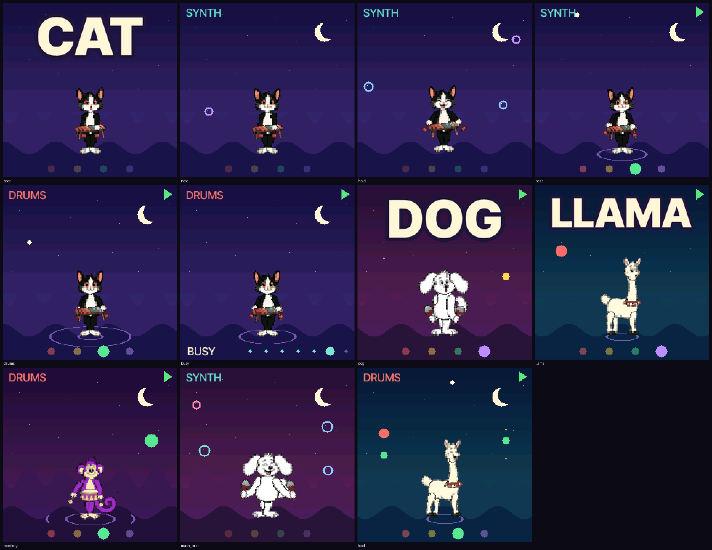

# PurpleMonkey FM-1

A firmware for the **M-VAVE FM-1** for a small child: press any key and something nice happens. Six-operator FM
notes on a pentatonic scale, synthesised drums, a backing beat, four animal friends (Monkey, Cat, Dog, Llama) on a
screen that moves with the music. No menus, nothing to save, nothing to break.

> **Status: an emulator-verified first slice. It has never been installed on an FM-1.**
> Do not install the built package without reading
> [docs/PURPLEMONKEY.md, "Install, rollback"](docs/PURPLEMONKEY.md#install-rollback-for-later-nothing-has-been-installed).
> The sounds were tuned by measurement, not yet by ear, and there is no speech. Update mode is OCT- + OCT+ + HOME held 5 s.



## Try it (Mac, no FM-1 needed)

```
pip3 install Pillow fonttools
brew install libraqm sdl2
sh tools/emu/build_pm.sh
build/host/pm_emu --front
```

| Computer key | FM-1 | PurpleMonkey |
| --- | --- | --- |
| `A S D F G H J K L ; ' ]` and `W E T Y U O P`, `2 3 4 5`, `F1`..`F4`, Tab | the note keys | play |
| `F5` | FX | DRUMS |
| `F6` | SEL | SYNTH |
| `-` | PLAY | BEAT on / off |
| `7` | HOME | knobs back to normal |
| Page Up / Page Down, then Up / Down | select a knob of SELECT, KNOB 1..4; turn it | PET, SPEED, BUSY, BOUNCE, SQUISH |
| mouse wheel over a knob | any knob, PRESETS and ALGORITHM too | BRIGHT, LENGTH |

Every key and button can also be clicked. `build/host/pm_emu --help` has the full map and options
(`tools/emu/README.md` describes the emulator; it is ChoralRoot's, with PurpleMonkey's firmware in it).

## What is here

| Path | What |
| --- | --- |
| [`docs/PURPLEMONKEY.md`](docs/PURPLEMONKEY.md) | what it does, how it is built, where it differs from the brief, what was verified, budgets, open questions |
| [`docs/UPSTREAM.md`](docs/UPSTREAM.md) | the exact upstream revisions and every change made to imported files |
| [`CLAUDE_HANDOFF.md`](CLAUDE_HANDOFF.md) | the brief |
| `firmware/src/pm_*.c`, `purplemonkey.c` | PurpleMonkey's code; the rest of `firmware/` is ChoralRoot's (Felucca's platform) |
| `tools/gen_pm_*.py`, `tools/emu/pm_*`, `tests/pm_*`, `tests/run_pm_tests.sh` | its generators, emulator side and tests |
| `assets/purplemonkey/` | the approved concept art the sprites are cut from |
| `docs/` (other files), `docs/upstream/`, `web/`, `firmware/src/cr_*.c` | ChoralRoot's, kept as reference and as the baseline build |

## Build and test

See [BUILDING.md](BUILDING.md).

```
sh tests/run_pm_tests.sh     # the engine's unit tests, then the emulator's acceptance scripts
./build.sh                   # the device image and package (needs Docker and the JieLi toolchain); installs nothing
```

## Licence

GPL-3.0-only ([LICENSE](LICENSE)), as its sources: built on [ChoralRoot FM-1](https://github.com/Quixotic7/ChoralRootFM1),
which is built on [Felucca](https://github.com/hugelton/Felucca) by Leo Kuroshita (Hügelton Instruments) with the FM6
engine of [Melodee](https://github.com/keremimo/melodee) by Kerem Kilic; the drum synthesis is from
[SLOOP](https://github.com/isod89/sloop-fm1). [LICENSING.md](LICENSING.md) has the whole list. Independent of and
unaffiliated with M-VAVE; M-VAVE and FM-1 are trademarks of their owners. Installing firmware is at your own risk.
